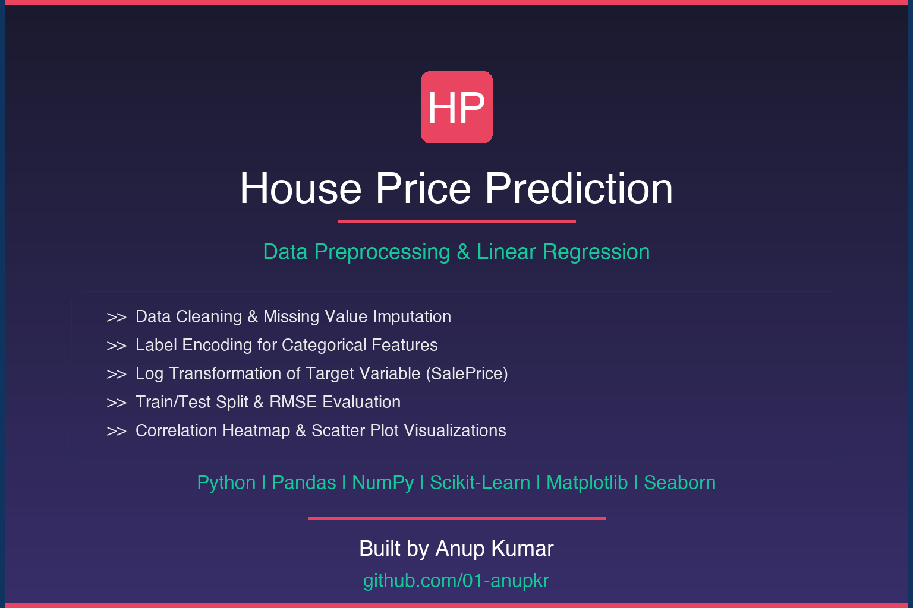

<p align="center">
  
</p>
# 🏠 House Price Prediction

**Project Type:** Data Preprocessing & Regression Modeling  
**Source:** [Kaggle - House Prices: Advanced Regression Techniques](https://www.kaggle.com/competitions/house-prices-advanced-regression-techniques/data)

[](https://colab.research.google.com/github/01-anupkr/House-Price-Prediction/blob/main/house_price_preprocessing.ipynb)

---

## 🎯 Objective

Prepare the Ames Housing dataset for regression modeling by applying:
- ✅ Data cleaning & missing value imputation  
- ✅ Label Encoding for categorical features  
- ✅ Log transformation of the target variable (`SalePrice`)  
- ✅ Train/test splitting and evaluation using RMSE  

---

## 📁 Project Structure
```
House-Price-Prediction/
├── assets/
│   └── banner.png
├── data/
│   ├── train.csv
│   ├── test.csv
│   ├── sample_submission.csv
│   └── data_description.txt
├── house_price_preprocessing.ipynb  # Main notebook
├── submission.csv                   # Generated output (after model run)
├── requirements.txt                # Python dependencies
├── .gitignore                      # Files to exclude from Git tracking
├── LICENSE                         # MIT License
└── README.md                       # Project documentation

```


---

## ⚙️ Features Processed

- 🔍 Imputed missing values (median for numerics, "Missing" for categoricals)
- 🔁 Combined train & test before encoding to handle unseen labels
- 🔢 Applied `LabelEncoder` for all categorical features
- 🔄 Performed `log1p()` transformation on `SalePrice`
- 🧪 Split data into training and validation sets

---

## 📊 Libraries Used

- `pandas` — Data manipulation  
- `numpy` — Numerical operations  
- `matplotlib` & `seaborn` — Visualizations  
- `scikit-learn` — Preprocessing, modeling, evaluation  

--- 

## 🚀 How to Run the Project

1. ✅ **Install Required Libraries**
   ```bash
   pip install pandas numpy scikit-learn matplotlib seaborn
   ```

2. 📂 **Download and Unzip the Project Folder**

   Make sure the folder structure looks like this:
   ```
   house-price-prediction/
   ├── house_price_preprocessing.ipynb
   └── data/
       ├── train.csv
       └── test.csv
   ```

3. 🧠 **Run the Notebook**

   - Open `house_price_preprocessing.ipynb` in **Jupyter Notebook** or **VS Code**
   - Run all cells sequentially to execute data preprocessing, model training, and evaluation

4. 📄 **Generate Predictions**

   After running all cells, a file named `submission.csv` will be generated:
   submission.csv

---

## 📎 Dataset Credit

📊 Data provided by Kaggle:House Prices - Advanced Regression Techniques(https://www.kaggle.com/competitions/house-prices-advanced-regression-techniques/data)

---

## 🙋‍♂️ Author

**Anup Kumar**  
💻 [GitHub](https://github.com/01-anupkr)  

---

# House-Price-Prediction
🏠 Predict house prices using Linear Regression and data preprocessing (Kaggle dataset). Includes data cleaning, label encoding, feature engineering, and model evaluation.
